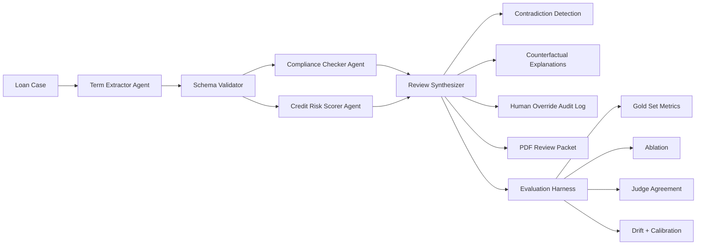

# CLARA - Credit Loan Analysis & Review Agent

Week 3 project for the Gen Academy Agentic AI Bootcamp.

CLARA is a LangChain + LangGraph product for reviewing small business loan applications with specialist agents, human-in-the-loop audit controls, rigorous evaluation, and exportable review packets.

## Portfolio Summary

This project treats agentic AI as a high-stakes financial decision-support workflow rather than a simple automation demo. A LangGraph orchestrator coordinates specialist agents for term extraction, compliance review, and credit risk scoring. The system then surfaces contradictions, generates counterfactual explanations, supports reviewer policy modes, logs human overrides, exports a PDF review packet, and evaluates performance against a structured 30-case SBA-style gold set.

Default mode is deterministic so evaluation is reproducible. Live LangChain-backed LLM mode is the differentiator for the Agentic AI demo: it routes agents and judge models through an OpenAI-compatible provider such as Nebius, displays live per-case progress for long 30-case runs, and can emit LangSmith traces for observability.

## Why It Matters

Loan review decisions can affect whether a small business receives capital, survives a cash crunch, or expands hiring. That makes correctness, explainability, and auditability central engineering requirements. This project emphasizes evaluation and governance: ablations, judge agreement, confidence calibration, drift detection, contradiction handling, counterfactuals, and human override logs.

## Highlights

- LangGraph fan-out/fan-in orchestration with parallel specialist review
- Agents for term extraction, compliance checking, and credit risk scoring
- Reviewer policy mode for SBA reviewer, bank underwriter, and CDFI lender postures
- Contradiction detection between compliance and credit-risk outputs
- Counterfactual explanations for remediable loan review issues
- Human override audit log per finding
- PDF export of the review packet
- LangSmith-compatible optional tracing
- 30-case gold-set evaluation with clean, ambiguous, and adversarial tiers
- Ablation visualization, LLM-as-judge scaffold, inter-rater agreement, live LLM drift probing, deterministic drift benchmarking, and confidence calibration
- Per-case progress indicators for full live 30-case evaluation and judge runs
- FastAPI SSE streaming endpoints for live agent and evaluation events
- GitHub Actions CI for lint, compile, and tests

## Results Snapshot

Current deterministic evaluation results on the controlled SBA-style gold set:

| Metric | Result |
| --- | ---: |
| Gold set size | 30 cases |
| Difficulty tiers | 10 clean / 10 ambiguous / 10 adversarial |
| Final outcome accuracy | 100.00% |
| Risk band accuracy | 100.00% |
| Deterministic drift stability | 100.00% across 5 runs per case |
| Risk confidence expected calibration error | 17.00% |
| Test suite | 81 passing tests |

The deterministic benchmark is intentionally controlled: it validates orchestration, scoring contracts, ablations, and UI behavior against a stable 30-case set. The live LLM mode is where non-deterministic agent behavior, primary/secondary judge disagreement, and LangSmith traceability become visible. Confidence calibration remains visible as a separate quality signal even when label accuracy is high.

## Data Scope

The checked-in data is a curated SBA-style seed set, not a full production SBA corpus. It is designed for reproducible evaluation and contains clean, ambiguous, and adversarial cases with hand-authored labels. The project includes a public SBA FOIA loader scaffold in `loan_pipeline/data/load_sba_public.py`; expanding the gold set from downloaded SBA Open Data exports is the strongest v2 improvement.

## Architecture Diagram



## Architecture

The pipeline uses a hybrid LangGraph DAG:

1. Term Extractor Agent extracts structured loan-review fields.
2. Schema Validator checks completeness and state quality.
3. Compliance Checker Agent and Credit Risk Scorer Agent run as parallel specialist reviewers.
4. Compliance Checker evaluates documentation and policy concerns.
5. Credit Risk Scorer assigns risk band, rationale, and confidence.
6. Orchestrator resolves contradictions and prepares a human review packet.
7. Counterfactual explainer generates actionable "what would change the outcome" guidance.
8. Human reviewer can override individual findings with an audit rationale.
9. PDF packet exporter creates a portable review artifact for the human decision record.
10. Evaluation Harness scores the system against a 30-case gold set.

The current orchestrator is backed by a compiled LangGraph `StateGraph`.

## Evaluation Standard

The evaluation harness is a first-class subsystem.

Gold set:

- 10 clean loan cases
- 10 ambiguous loan cases
- 10 adversarial loan cases

Evaluation includes:

- Agent-level metrics
- End-to-end pipeline metrics
- Ablation study
- LLM-as-judge scoring
- Second judge model agreement
- Manual spot-checking
- Failure analysis by category
- Agent contradiction detection for human adjudication
- Counterfactual explanations for escalated or failed reviews
- Human override audit log per finding
- PDF export of the human review packet
- Ablation visualization that shows each agent's measured contribution
- Confidence calibration comparing risk confidence to observed accuracy
- Live LLM drift probe for selected-case nondeterminism
- Deterministic drift benchmark for repeated 30-case reproducibility
- LangGraph execution trace showing the parallel specialist review stage
- Reviewer policy mode: SBA reviewer, bank underwriter, and CDFI lender

## Project Structure

```text
loan_pipeline/
  agents/
    term_extractor.py
    compliance_checker.py
    credit_risk_scorer.py
  graph/
    state.py
    orchestrator.py
    edges.py
  eval/
    gold_set.json
    judge.py
    ablation.py
  review/
    contradictions.py
    counterfactuals.py
  ui/
    app.py
  data/
    sba_loans.csv
    load_sba_public.py
  config.py
docs/
  architecture.md
  data_source.md
  demo_script.md
  evaluation_plan.md
  cv_bullets.md
sample_documents/
  Northstar_Custom_Cabinets_Loan_Profile.pdf
requirements.txt
README.md
tests/
Dockerfile.api
docker-compose.yml
```

## Useful Docs

- [Architecture](docs/architecture.md)
- [Evaluation Plan](docs/evaluation_plan.md)
- [Data Source Notes](docs/data_source.md)
- [Deployment Guide](DEPLOYMENT.md)
- [Demo Script](docs/demo_script.md)
- [CV And Interview Notes](docs/cv_bullets.md)
- [Sample Loan Documents](sample_documents/README.md)

## Setup

Create and activate a virtual environment:

```powershell
py -3.12 -m venv .venv
.\.venv\Scripts\Activate.ps1
```

Install pinned dependencies:

```powershell
python -m pip install --upgrade pip
pip install -r requirements.txt
```

Copy environment variables:

```powershell
Copy-Item .env.example .env
```

Live LLM agent demo mode:

```text
USE_LLM_AGENTS=true
LLM_PROVIDER=nebius
NEBIUS_API_KEY=your_nebius_key
NEBIUS_BASE_URL=https://api.tokenfactory.nebius.com/v1/
OPENAI_MODEL=Qwen/Qwen3-235B-A22B-Instruct-2507
LLM_TEMPERATURE=0.2
PRIMARY_JUDGE_MODEL=Qwen/Qwen3-235B-A22B-Instruct-2507
SECONDARY_JUDGE_MODEL=openai/gpt-oss-120b
JUDGE_TEMPERATURE=0.2
```

The default deterministic mode keeps evaluation reproducible. For a live Agentic AI demo, set `USE_LLM_AGENTS=true` with `NEBIUS_API_KEY` and `NEBIUS_BASE_URL`. The project uses LangChain's OpenAI-compatible chat client, so Nebius model endpoints work by passing the Nebius base URL. In live mode, the Term Extractor, Compliance Checker reviewer note, and Credit Risk Scorer rationale use model calls. If `PRIMARY_JUDGE_MODEL` and `SECONDARY_JUDGE_MODEL` are set, the evaluation judge and inter-rater agreement flow use live model judges too. Set `LLM_TEMPERATURE` and `JUDGE_TEMPERATURE` above `0` when you want to demonstrate non-deterministic language behavior. The Drift tab has two modes: a selected-case live LLM drift probe for true repeated model calls, and a 30-case deterministic benchmark for reproducible baseline stability.

Optional LangSmith tracing:

```text
LANGSMITH_TRACING=true
LANGSMITH_API_KEY=your_langsmith_key
LANGSMITH_PROJECT=loan-review-pipeline
```

Tracing is optional and off by default. When enabled, the pipeline emits LangSmith traces for the top-level loan review run, Term Extractor, Compliance Checker, Credit Risk Scorer, and Review Synthesizer. Deterministic mode remains reproducible while still giving an observable graph execution record.

Run the legacy Streamlit app:

```powershell
streamlit run loan_pipeline/ui/app.py
```

The Streamlit dashboard remains available as a local fallback. The primary demo UI is the Next.js app in `web/`.

Run the Next.js UI:

```powershell
cd web
npm.cmd install
$env:NEXT_PUBLIC_API_BASE_URL="http://127.0.0.1:8000"
npm.cmd run dev
```

Run the Dockerized full stack:

```powershell
Copy-Item .env.docker.example .env
docker compose up --build
```

Then open:

```text
http://localhost:3000
```

Run the optional SSE API:

```powershell
uvicorn loan_pipeline.api.app:app --reload --port 8000
```

Useful streaming endpoints:

```text
GET http://127.0.0.1:8000/health
GET http://127.0.0.1:8000/cases
GET http://127.0.0.1:8000/review/stream?case_id=ADV-001&policy=sba_reviewer
GET http://127.0.0.1:8000/evaluation/stream
GET http://127.0.0.1:8000/drift/live/stream?case_id=ADV-001&policy=sba_reviewer&repeats=3
GET http://127.0.0.1:8000/judge-agreement/stream
```

The SSE API emits events such as `run_started`, `agent_completed`, `drift_activity`, `drift_run_completed`, `progress`, `run_completed`, and `error`. This is intended for production-style observability and demoing that the agents are actively moving through the graph.

## Demo Script

See [docs/demo_script.md](docs/demo_script.md) for the polished presentation walkthrough.

See [DEPLOYMENT.md](DEPLOYMENT.md) for local, Vercel, and backend-host deployment setup.

Quick start:

```powershell
.\.venv\Scripts\python.exe -m uvicorn loan_pipeline.api.app:app --host 127.0.0.1 --port 8000 --reload
cd web
npm.cmd run dev
```

## Cupcake MVP

The first vertical slice uses SBA-style sample cases, rules-first agents, and a compiled LangGraph workflow:

- `CLEAN-001`: straightforward low-risk case
- `AMB-001`: ambiguous case with missing owner credit report
- `ADV-001`: adversarial case with prior default and missing documents

Run tests:

```powershell
pytest
```

Run the 30-case evaluation:

```powershell
python -m loan_pipeline.eval.run_eval
```

The evaluation output includes metric accuracy, failure categories, and local judge-dimension averages.

Run the ablation study:

```powershell
python -m loan_pipeline.eval.ablation
```

Run the inter-rater agreement scaffold:

```powershell
python -m loan_pipeline.eval.inter_rater
```

Generate the Markdown evaluation report:

```powershell
python -m loan_pipeline.eval.report
```

## Limitations And Next Steps

- Default mode uses deterministic agent internals for reproducible evaluation; optional LLM mode is available through `USE_LLM_AGENTS=true`.
- Reviewer policy modes are configurable institutional postures, not official legal determinations.
- The included 30-case gold set is SBA-style seed data; the public SBA FOIA loader is scaffolded for larger hand-adjudicated datasets.
- Next production steps would be FastAPI service packaging, durable checkpointing for long-running human review, and richer document parsing for scanned loan packets.

Normalize a downloaded SBA FOIA CSV in code:

```python
from pathlib import Path
from loan_pipeline.data.load_sba_public import load_sba_public_cases

cases = load_sba_public_cases(Path("loan_pipeline/data/foia_7a_2020_present.downloaded.csv"))
```

## SDLC Status

- Step 1: Problem Statement complete
- Step 2: Architecture Design complete
- Step 3: Environment & Hygiene complete
- Step 4: Cupcake MVP complete
- Step 5: Peer Review Iteration complete
- Step 6: Edge-Case Stress Testing complete
- Step 7: Ship Early Demo complete
- Step 8: Iteration Flywheel in progress
