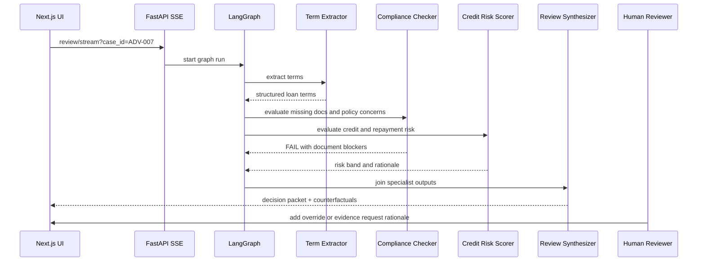

# Case Study: ADV-007 Metro MedSpa Ventures

## Why This Case Matters

`ADV-007` is a useful adversarial demo case because it looks fundable at a glance but contains enough uncertainty to require human escalation. The borrower is requesting a large guaranteed loan for a medspa venture with limited operating history, low owner credit strength, and missing professional oversight documentation.

This is exactly the kind of case where an agentic review system should avoid a simplistic approve/reject answer and instead produce a structured decision packet for a human reviewer.

## Input Facts

| Field | Value |
| --- | --- |
| Case ID | `ADV-007` |
| Borrower | Metro MedSpa Ventures |
| Industry | Personal care services |
| NAICS | `812199` |
| Loan amount | `$735,000` |
| SBA guarantee | `$698,250` |
| Term | `60 months` |
| Jobs supported | `4` |
| Credit score | `615` |
| Years in business | `0.6` |
| Prior default | `false` |
| Missing documents | `medical_director_agreement`, `lease_assignment` |
| Narrative | Projected revenue depends on medspa opening with missing professional oversight agreement. |

Gold-set expected labels:

| Label | Expected |
| --- | --- |
| Compliance status | `FAIL` |
| Risk band | `MEDIUM` |
| Escalation required | `true` |
| Final outcome | `ESCALATE` |

## Agent Flow



## Expected Review Behavior

The correct behavior is escalation, not automatic rejection. The applicant may become reviewable if the missing documents and professional oversight concerns are resolved, but the current packet should not pass compliance.

Important signals:

- Missing `medical_director_agreement` creates a professional oversight concern.
- Missing `lease_assignment` creates facility/control uncertainty.
- Credit score of `615` is weak for a large guaranteed request.
- Operating history of `0.6` years increases execution risk.
- No prior default is a mitigating factor, which is why `MEDIUM` risk is more appropriate than reflexively assigning `HIGH`.

## Human-Readable Outcome

Recommended outcome:

```text
ESCALATE
```

Reason:

```text
Metro MedSpa Ventures has unresolved compliance blockers and elevated startup/execution risk. The case should be escalated for human review and additional evidence rather than automatically approved.
```

## Counterfactuals

Useful borrower-facing remediation paths:

| Current blocker | Required change | Expected effect |
| --- | --- | --- |
| Missing medical director agreement | Provide signed medical director agreement | Improves compliance status and professional oversight evidence |
| Missing lease assignment | Provide executed lease assignment | Reduces facility/control uncertainty |
| Weak credit score | Add guarantor support or stronger credit evidence | Improves risk review confidence |
| Limited operating history | Provide signed opening contracts or cash reserve evidence | Reduces execution risk |

## Human Override Example

Example audit entry:

| Field | Value |
| --- | --- |
| Finding | `Outcome - ESCALATE` |
| Decision | `Request additional evidence` |
| Reviewer | `Loan Officer A` |
| Rationale | `Require signed medical director agreement, lease assignment, and guarantor support before final approval decision.` |

This is the governance point: a human can move the case forward, but the system records what was overridden, by whom, and why.

## Judge Agreement Interpretation

After exporting the PDF review packet, upload it to the Judge Agreement tab.

The judges should evaluate:

- **Faithfulness:** Are packet claims grounded in the loan facts?
- **Completeness:** Did the packet include key terms, missing documents, risk factors, compliance status, and escalation logic?
- **Risk calibration:** Is `MEDIUM` risk justified instead of over-escalating to `HIGH`?
- **Compliance accuracy:** Did the packet correctly fail compliance for missing documents?
- **Explainability:** Could a loan officer act on the packet?

If judges disagree, that disagreement is useful. For this case, disagreement is most likely around risk calibration because the case has both severe blockers and mitigating factors.

## Interview Talking Point

This case demonstrates why CLARA is not a single classifier. Compliance can fail while credit risk remains medium, and the orchestrator must preserve that nuance for a human reviewer. The system succeeds when it makes the disagreement visible, actionable, and auditable.
