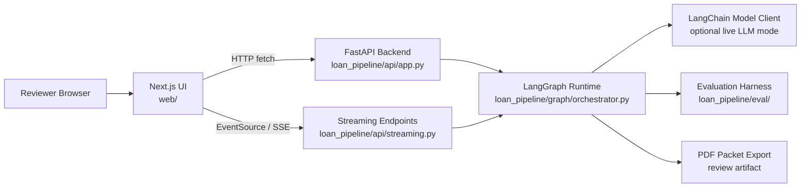
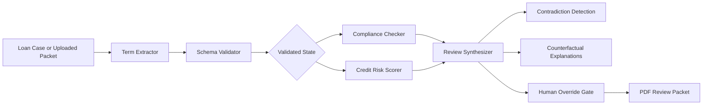
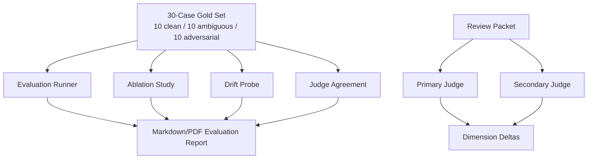
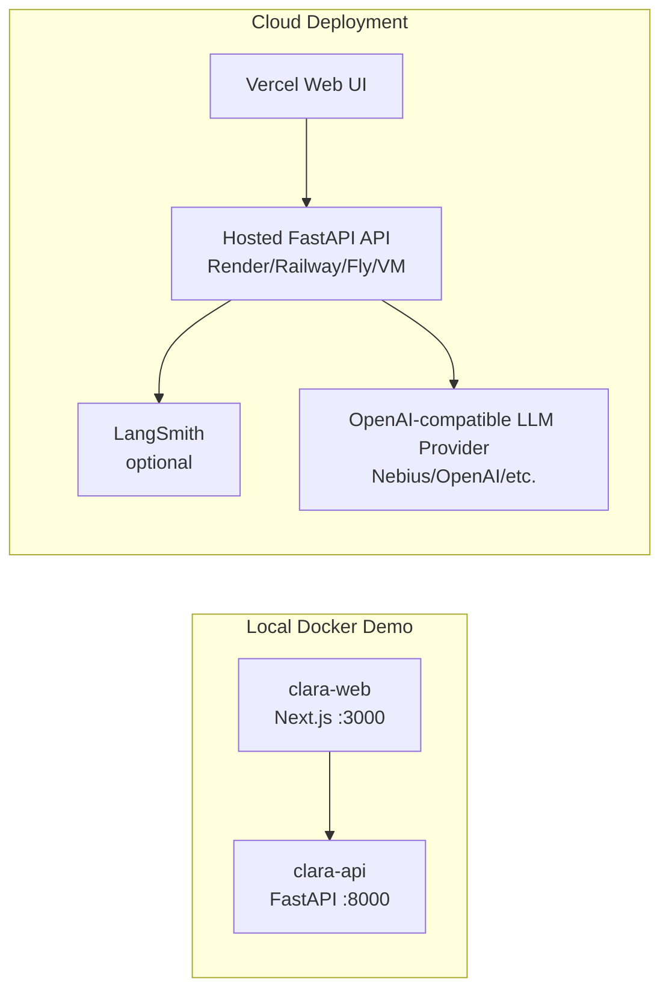

# CLARA System Architecture

CLARA is split into a browser-facing product UI, a streaming API layer, a LangGraph orchestration layer, specialist agents, and an evaluation/governance layer.

## High-Level Runtime

## Loan Review Graph

## Evaluation And Governance

## Request Flow

1. The reviewer selects a seeded SBA-style case or uploads a loan document.
2. The Next.js UI calls the FastAPI backend.
3. For live review, the UI opens an SSE stream.
4. FastAPI sends the case into the compiled LangGraph workflow.
5. Term extraction and schema validation create structured shared state.
6. Compliance and credit risk agents evaluate the case as independent specialists.
7. The synthesizer joins outputs, detects contradictions, and creates counterfactuals.
8. The UI renders the live timeline and decision packet as events arrive.
9. The reviewer can add a human override with rationale.
10. The review packet can be exported as a PDF and independently judged.

## Why This Architecture Works

- **FastAPI SSE** makes long-running graph work visible instead of leaving the user on a frozen screen.
- **LangGraph state** keeps agent outputs structured and auditable.
- **Parallel specialist review** creates real division of responsibility between compliance and credit risk.
- **Human override logging** turns the system into decision support rather than autonomous lending.
- **Evaluation harness** makes performance measurable across clean, ambiguous, and adversarial cases.
- **Docker Compose** packages the API and UI as separate deployable services.

## Deployment Shape

For the bootcamp demo, the local Docker stack is the most reliable recording path. For public sharing, deploy the Next.js frontend and point `NEXT_PUBLIC_API_BASE_URL` to a hosted FastAPI backend.
